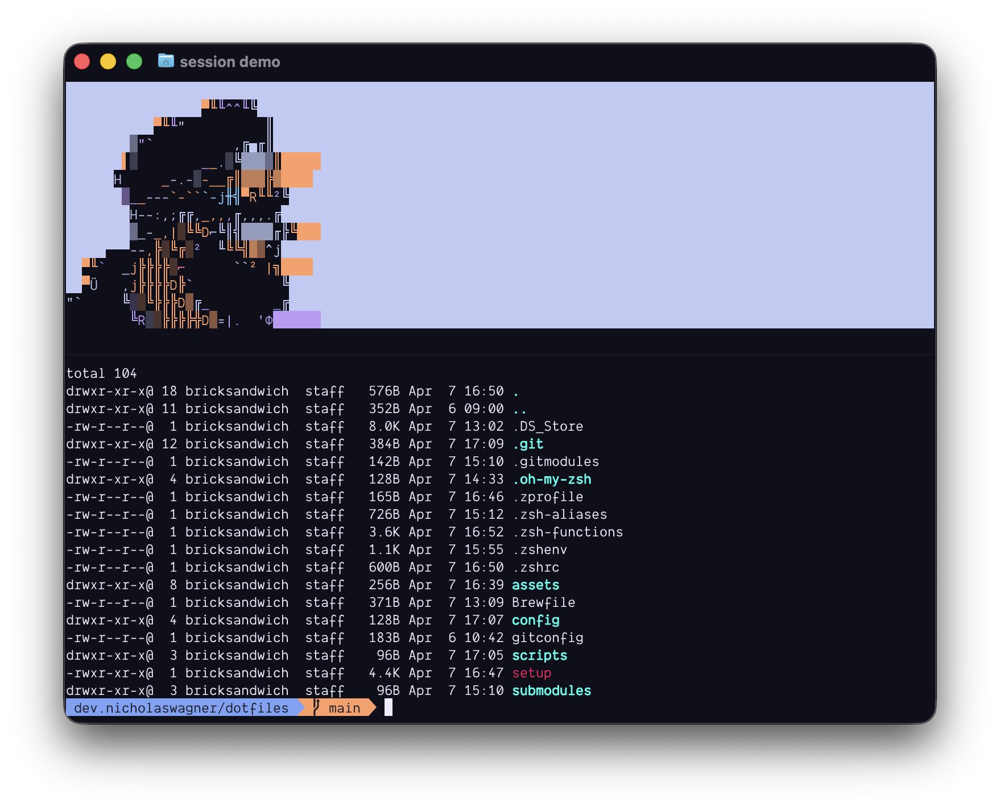

# ~/dotfiles



A collection of dotfiles and helper scripts I use day-to-day on my MacBook Pro. Version-controlled so I can spin up a new machine quickly, keep changes tracked, and stop reconfiguring things I've already figured out. 


## Requirements

- macOS (Apple Silicon)
- git (available by default on macOS via Xcode Command Line Tools)

## What it sets up

| Tool | Description |
| ---- | ----------- |
| [Oh My Zsh](https://ohmyz.sh) | Zsh framework with plugins and themes |
| [Homebrew](https://brew.sh) | Package manager — installs everything in `Brewfile` |
| [nvm](https://github.com/nvm-sh/nvm) | Node Version Manager + latest Node |
| [bun](https://bun.sh) | JavaScript runtime |
| tmux | Terminal multiplexer with custom session layout |

## Shell config

| File | Purpose |
| ---- | ------- |
| `.zshenv` | Environment variables, always loaded |
| `.zprofile` | Login shell setup (Homebrew, PATH) |
| `.zshrc` | Interactive shell (Oh My Zsh, plugins, aliases) |
| `.zsh-aliases` | Command aliases |
| `.zsh-functions` | Shell functions |

All files are symlinked from `~/dotfiles` to `~` by the setup script.

## tmux session

A custom session layout with an ANSI art banner pinned to the top pane:

```zsh
session          # start or attach to "main"
session work     # start or attach to a named session
```

Keybindings: `Ctrl+b d` to detach, `Ctrl+b [` to scroll.

## Secrets

The LM Studio API key is stored in the macOS Keychain and never committed. After running setup, store it once with:

```zsh
security add-generic-password -a "$USER" -s "LM_STUDIO_API_KEY" -w "your-key" -T /usr/bin/security
```

## Structure

```text
dotfiles/
├── assets/          # ANSI art banners
├── config/
│   ├── tmux.conf
│   └── lm_models_config.json
├── scripts/
│   └── session      # tmux session launcher
├── submodules/
│   └── source-maps-downloader
├── .oh-my-zsh/
│   └── custom/      # themes and plugins
├── .zshenv
├── .zprofile
├── .zshrc
├── .zsh-aliases
├── .zsh-functions
├── Brewfile
├── gitconfig
└── setup
```
